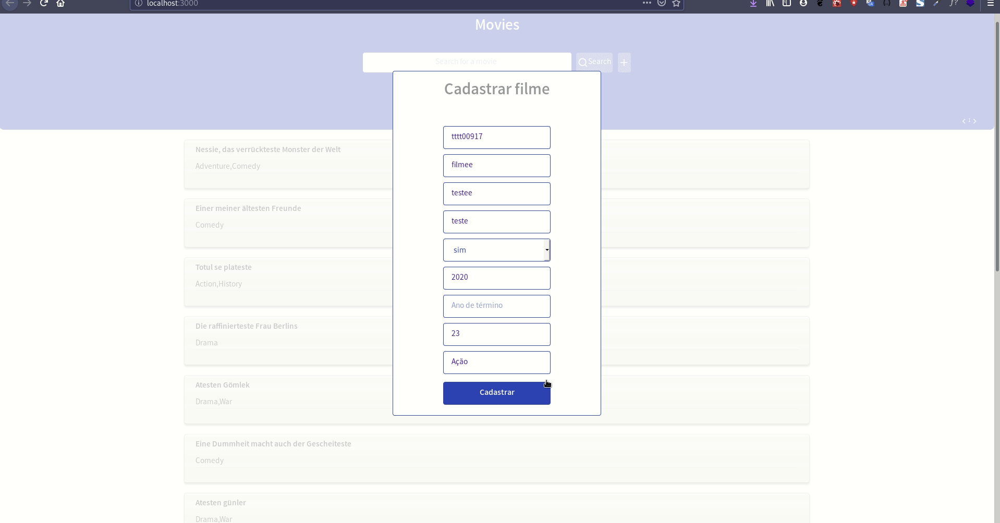
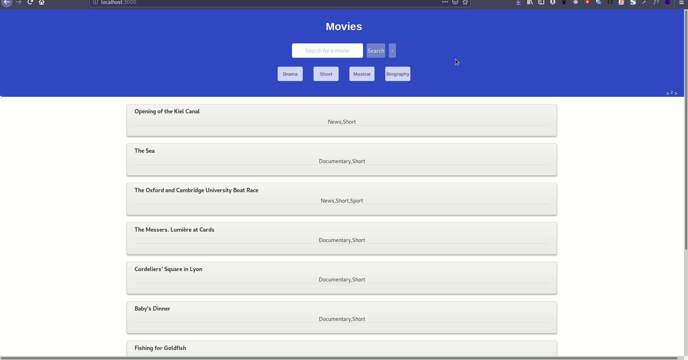

<h1 align="center">
  
<br>
Desafio full stack Bonaparte Agência
</h1>

<p align="center"> Aplicação Web que lista filmes. Para fonte de dados foi utilizado dois arquivos fornecidos pelo   
    <a aria-label="IMDB" href="https://www.imdb.com/interfaces/">
    imdb
  </a>


<p align="center">
  <a aria-label="Prando" href="https://github.com/gprando/">
    </img>
  </a>
    </img>
    </img>
</p>
<p align="center">
  <a href="https://opensource.org/licenses/MIT">
    
  </a>
</p>


## 
## Features

- - Possibilidade de busca dos dados

- - Possibilidade de visualização do detalhe de um filme

- - Possibilidade de inserção de novos filmes

- - Responsivo
  - REST API com os endpoints necessários para atender as necessidades acima

## Tecnologias utilizadas

- linguagem:
  - Como o projeto era pequeno e tinha seu escopo fechado decidi optar pelo uso de javascript com arquitetura MVC ao invés de typescript com SOLID. 

- Backend: 
  - Framework escolhido foi o express devido a ser um framework sem opnião, perfeito para microsserviços.
  -  Para o banco optei pelo mongoDB, com o ODM mongoose, devido a uma larga escala de dados e sem relacionamentos, o único relacionamento seria do movie com o rating, mas dentro do arquivo de dados do rating já havia a referência de cada movie. O que resultou em uma ótima performance, filtro de todos  os filmes em milissegundos mesmo tendo milhões de dados no banco.
- Frontend:
  - React utilizando React hooks.
  - Vue com nuxtJs.

## Projeto

Este desafio foi desenvolvido com o intuído de mostrar minhas habilidades nas tecnologias citadas a cima.


## Instalação - Projeto

##### Requisitos: 

- Preferencialmente ambiente Unix.

  

Clone o projeto em seu computador.

```bash
git clone https://github.com/gprando/bonaparte-desafio-full-stack
```

## Backend
Para instalar as dependências, importar os datos para o banco de dados e executar o **Servidor** (modo desenvolvimento) execute:
```bash
# entra na pasta
cd backend

#instala as dependências
yarn 
#executa o servidor na porta 3333
yarn dev
```
### Insomnia 
Para testar a API, baixe e instale o [Insomnia](https://insomnia.rest/download/) e em seguida clique no botão a baixo para importar o workspace.

[](https://insomnia.rest/run/?label=Desafio&uri=https%3A%2F%2Fraw.githubusercontent.com%2Fgprando%2Fbonaparte-desafio-full-stack%2Fmaster%2Fbackend%2FInsomnia_2020-08-15.json)

### Frontend
Para iniciar o **Frontend** do React utilize os comandos:
```bash
# entra na pasta
cd frontend-react

# instala as dependências
yarn
# Executa em modo desenvolvimento
yarn dev
```
Assim que o processo terminar, automaticamente será aberta no seu navegador a página `localhost:3000` 




Para iniciar o **Frontend** Vue utilize os comandos:

```bash
# entra na pasta
cd frontend-nuxt

# instala as dependências
yarn
# Executa em modo desenvolvimento
yarn dev
```

Assim que o processo terminar, automaticamente será aberta no seu navegador a página `localhost:3000`




## 🤔 Como contribuir

Se quiser contribuir para esse repositório aqui, seja corrigindo algum problema, adicionando comentários ou melhorando a documentação, você pode seguir esse tutorial abaixo:

- Faça [um fork](https://help.github.com/pt/github/getting-started-with-github/fork-a-repo) desse repositório;
- Entre no seu perfil no GitHub e faça um clone do repositório que você fez um *fork*;
- Crie uma *branch* com a sua alteração: `git checkout -b minha-alteracao`;
- Faça as alterações necessárias no código ou na documentação;
- Faça *commit* das suas alterações: `git commit -m 'feat: Minha nova feature'`;
- Faça *push* para a sua *branch*: `git push origin minha-alteracao`;
- Agora é só abrir a sua *pull request* no repositório que você fez o *fork*;

Depois que o *merge* da sua *pull request* for feito, você pode deletar a sua *branch*.

## :memo: Licença

Esse projeto é licensiado pela MIT License - Veja a página da [licença](https://opensource.org/licenses/MIT) para detalhes